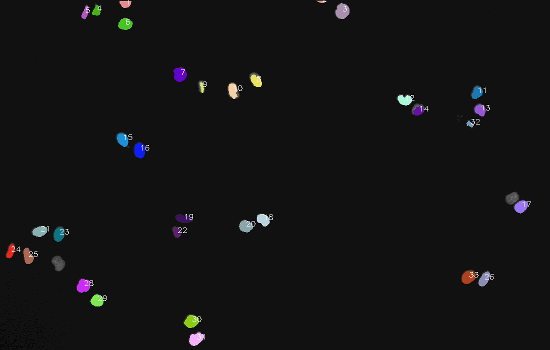
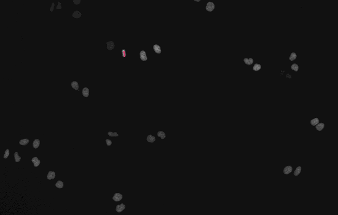

# Cancer-Cell-Tracking
Python implementation on tracking cancer cell based on Li et al. [1](https://www.ncbi.nlm.nih.gov/pubmed/19643704), which used watershed algorithm to segment cells and built a feature vector for cell tracking including the information of position, shape, spatial distribution and texture.  

[1]Li,F.,Zhou,X.,Ma,J.,&Wong,S.T.(2010).Multiplenuclei tracking using integer programming for quantitative can- cer cell cycle analysis. Medical Imaging, IEEE Transactions on, 29(1), 96-105.

## Usage
0. The data can be found at [Cell Tracking Challenge Website](http://www.codesolorzano.com/Challenges/CTC/Datasets.html). 

1. ipython notebook: to better show the algorithm step by step, besides the python scipts, I also create a ipython notebook to visualize the interim results.

2. Some explanation of the scripts:
```
main.py // the main procedure including all steps.
```
```
adaptivethresh.py // compute adaptive thresholding of image sequence in order to generate binary image for Nuclei segmentation.
```
```
gvf.py // compute gradient vector field (GVF) to find the seeds for following watershed.
```
```
watershed.py // segment cells
```
```
graph_construction.py // generate a neighboring graph contraction using Delaunary Triangulation.
```
```
matching.py // calculate feature vector for each cell and match cells. 
```

## Results
Result of original image sequence. 

Result of tracking all cells. 

Result of tracking specific cell in mitosis. 

Plot of tracking the mitosis cell. 
