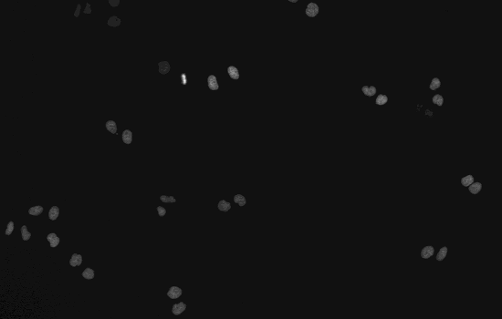
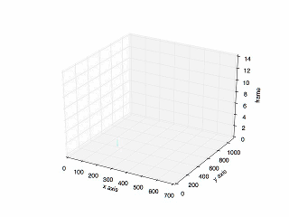

# Cancer-Cell-Tracking
Python implementation on tracking cancer cell based on [Li et al.](https://www.ncbi.nlm.nih.gov/pubmed/19643704), which used watershed algorithm to segment cells and built a feature vector for cell tracking including the information of position, shape, spatial distribution and texture.  

## Usage
1. The data can be found at [Cell Tracking Challenge Website](http://www.codesolorzano.com/Challenges/CTC/Datasets.html). 

2. ipython notebook: to better show the algorithm step by step, besides the python scripts, I also create a ipython notebook to visualize the interim results.

3. Some explanation of the scripts:
```Python
main.py # the main procedure including all steps.
```
```Python
adaptivethresh.py # compute adaptive thresholding of image sequence in order to generate binary image for Nuclei segmentation.
```
```Python
gvf.py # compute gradient vector field (GVF) to find the seeds for following watershed.
```
```Python
watershed.py # segment cells
```
```Python
graph_construction.py # generate a neighboring graph contraction using Delaunary Triangulation.
```
```Python
matching.py # calculate feature vector for each cell and match cells. 
```

## Results
1. Result of original image sequence. 


----

2. Result of tracking all cells. 


----

3. Result of tracking specific cell in mitosis. 


----

4. Plot of the previous tracking. 


